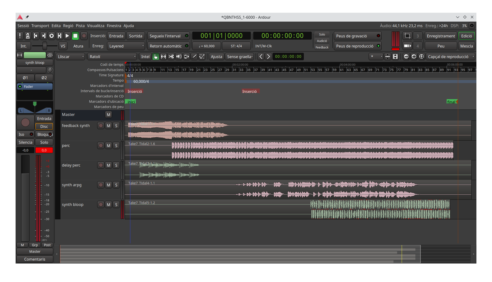
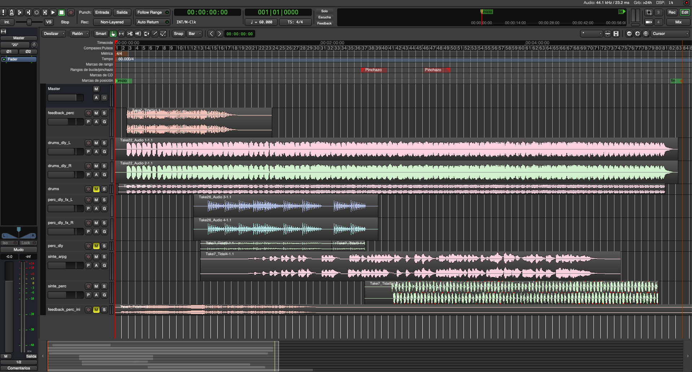

:::bio
*Check out the album [*The Magic Words Are Squeamish Ossifrage*, out 21/04/2023 on Interworld Media via Bandcamp](https://interworldmedia.bandcamp.com/album/the-magic-words-are-squeamish-ossifrage). QBRNTHSS works mainly in the glitch/noise, electronic, and experimental genres.
For next gigs and more info you can check
their [website](http://callitanything.org),
or follow them on [Instagram](https://www.instagram.com/rcasamajo/),
[Mastodon](https://mastodon.online/@QBRNTHSS),
or [X/Twitter](https://twitter.com/rcasamajo)*
:::

[](https://interworldmedia.bandcamp.com/album/the-magic-words-are-squeamish-ossifrage)

My name is Ramon Casamajó - aka *QBRNTHSS* (pronounced “quebrantahuesos”, meaning “bearded vulture” in Spanish). QBRNTHSS is the alias I use for my solo works focused on electronics. This post covers the live coding, mixing and recording process I used in my album, recently released through Interworld Media on Bandcamp.  

The album title - *The Magic Words Are Squeamish Ossifrage* is the plain text solution to many cryptographic challenges, a tradition originated in a challenge set by the authors of the RSA encryption algorithm in 1977. It is my first full-length album as QBRNTHSS, the result of more than a year of live performances and rehearsals using TidalCycles and Supercollider as main instruments. It’s published on the Sheffield label [Interworld Media](https://www.interworld.media/releases/the-magic-words-are-squeamish-ossifrage/) in digital download and cassette tape, and aesthetically it’s a mixture of synthetic textures, noisy ambients and broken rhythms.

I’m going to explain the recording process used for the whole album - except one track that was recorded previously without live coding, but I feel it fits in perfectly...I bet you can't guess what track it is :-)

## Hardware and software used

The album was recorded and mixed in different locations with this hardware and software equipment:  

- Lenovo ThinkPad T14 with Manjaro Linux
- Focusrite Scarlett 2i4
- Effects pedals: Boss DD-7 digital delay, TC Electronic Hall of Fame 2, Meris Ottobit Jr., Boss Metal Zone 2
- Korg Nanokontrol 2 midi controller
- Cadence (JACK)
- Carla plugin host
- VST synthesizers: Odin 2, Helm, Yoshimi
- Supercollider
- TidalCycles
- Ardour (DAW)

As sound sources I used some samples that I’ve been collecting for a while (specially the percussion ones), some other samples that I have recorded by myself, and Supercollider synths made by the community and a few ones by myself.

After the recording and mixing process the album was mastered by Alfonso EVEL at EVEL Records.

### Recording process

The record is the culmination of about a year performing and rehearsing. At some point I had a bunch of good ideas (at least that’s my impression), and the motivation to make a new album. But I didn't want to just record what I was doing live, my goal wasn’t to document my live practice. I wanted to do an album that was interesting and enjoyable for itself, an album that I would buy myself and listen to at home.  

From the beginning my conception of the album was to be a collection of short or concrete sound passages, the previous ideas went in this direction too. I didn’t want to record long soundscapes that evolve slowly over many minutes, which I love too, but that wasn't the point here.  

Also some time before the recording I had started to use some effects pedals to process the sound and make the live performances more dynamic and fun, so I wanted to use them on the album.

I decided to record on multiple tracks on the DAW (Ardour), and in more than one take when it was necessary. That allows me to:

- Polish the mix in the daw.
- Apply more controlled dynamic changes from TidalCycles than if I had to record in one single take. I could focus on some parts of the song one after another.
- Process some parts separately with the effects pedals afterwards.

That said, I didn’t record every sound in a separate track, just what I needed to let me construct the song comfortably. On the other hand I didn’t do overdubs once a track was recorded, only little edits sometimes.

So basically the record process for a song went like this:
- Play and record the different tracks from TidalCycles to Ardour.
- In Ardour adjust the mix and do some edits if necessary.
- With an effects loop record again some tracks through the effects pedals, applying as I like it.
- Finalize the mix with the final touches: adjusting volumes, final edits (some fade-ins or fade-outs, cutting some starting or ending parts, etc), and do some stereo panning in some tracks.

## Code
As an example, here is the code and DAW screenshots for the second song on the album, entitled *Bone:*

```haskell
setcps (60/60)

-- sustain loop
d1
$ trigger 1
$ s "snoisefb*5" # n "<b5'min7>"
# voice 1
# sustain (rangex 0.025 0.9 $ slow 100 $ tri)
# lock 1 # delay 0.2 # delayt 0.1 # delayfb 0.2
# accelerate 1 # speed 3
# pitch1 (range 0.02 0.1 $ slow 27 $ sine)
# resonance 2.5 # gain 0.75
# octer 1

do
  let pats =
    	[
      	("pl", s "HIHATS:6*4" # n ((irand 5)+10) # sustain 0.5),
      	("cr", s "KORGER1*4" # n ((irand 4)+29) # sustain 0.1),
      	("cl", s "~ claps ~ claps ~" # n ((irand 5)+2)),
      	("bb", s "[BASEDRUMS:22*4, BASEDRUMS:41*4]"),
      	("bs", s "BASEDRUMS" # gain 0.96 # n (choose [9,14,17,19,29,33])),
      	("sl", s "~")
    	]
  d2 $ fast 2 $ ur 6 "[{pl} sl bb]" pats[]
  d1
	$ stb 0.3 (fast 2)
	$ s "snoisefb*5" # n "<b5'min7>"
	# voice 1 # sustain 0.025
	# lock 1 # dly 0.2 0.1 0.2
	# accelerate 1 # speed 3
	# pitch1 (rgs 0.01 0.1 12)
	# resonance 2.5 # gain 0.75
	# octer 1

d3
$ trigger 3
$ slow 11
$ s "wndelayfb" # n "c"
# gain 0.9

xfadeIn 4 30
$ slow 10
$ off 0.01 (# fshift ((cF 0 "23")*220))
$ stb 0.3 (stutter 3 (1/32))
$ degradeBy 0.4
$ stb 0.4 (jux rev)
$ n (scramble 3 (arpg "<a5'min7>")) -- ff5'min9 d6'sus4
# s "sawdelayfb"
-- # pan rand
# sustain 5 # gain 0.9 # orbit 3

d5
$ n "c3" # s "fu"
-- # octave ((irand 5)+3)
# reps (((cF 0 "21")*3)+2)
# ftime (cF 0 "22")
# pan (rgs 0 1 2)
# gain 0.9
# lpf 1250

xfadeIn 1 19 sil -- fb
xfadeIn 2 20 silence -- beats
d3 sil -- perc dly
xfadeIn 4 20 silence -- arpg
xfadeIn 5 20 silence

```

## DAW - Ardour

The Ardour screenshot reflects the status after the first recording step. This is what I’ve recorded in every daw track:  

- d1 -> feedback synth
- d2 -> perc
- d3 -> delay perc
- d4 -> synth arpg
- d5 -> synth bloop




Next, the Ardour screenshot shows the status after the effects loop recording step, where some edits and extra tracks with the effects pedals were applied:  

- I changed the beginning of the song discarding the first part of the “feedback synth” track (you can see the final track as “feedback perc” and the original “feedback_perc_ini” muted).
- I used the Boss delay pedal to add some dub flavor to the original track "perc", resulting in “drums_dly” left and right (see the original track as “drums” muted).
- I used the TC Electronic pedal to add some reverb to the original  “delay perc” track, resulting in “perc_delay_fx” left and right (see the original track as “perc_dly” muted).



So that’s it. Hope that this post is interesting and that you can listen to *The Magic Words Are Squeamish Ossifrage.* Working on it was a challenge that I have enjoyed a lot, and I love the results… I think that finally I will buy the album!
